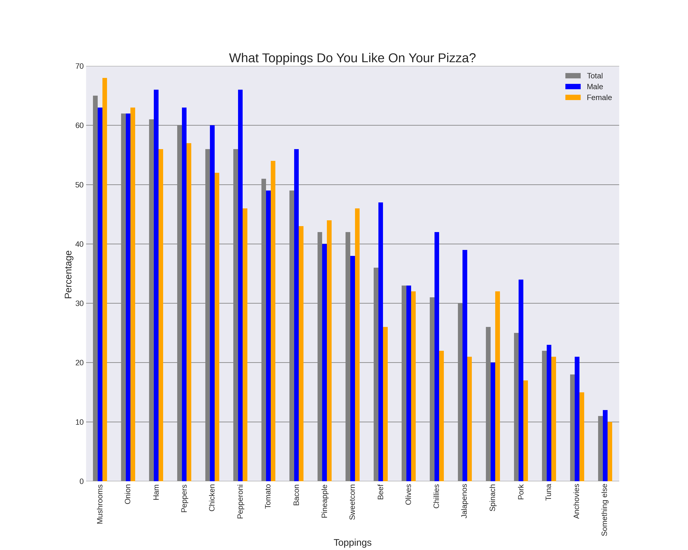

# Best-Pizza-Toppings
What are the best toppings to put on a pizza?

A survey was conducted asking people to select their favorite toppings for pizza. From the data gathered it was broken down into 3 percentage catagories based on topping; Male, Female and Total.

Comparing Total percentages we can see the most sought after topping is mushrooms, while anchovies are the least desirable.

When comparing Male to Female a couple trends become clear.

Males prefer meat and spicy more than females
Females prefer vegetables more than males

Above all, we learned that less than half the people surveyed like Pineapple on their pizza. So Pineapple should not be on pizza. (smile)

